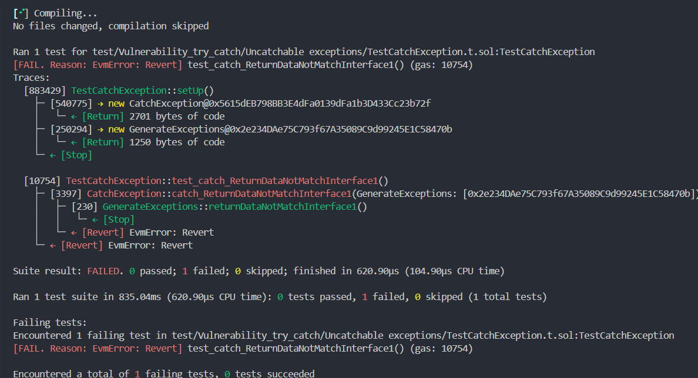

## The vuluerabiliry of try/catch

### Original

> **Sherlock::Teller Finance:Audit reports**
>
> The title of vulnerability is *EgisSecurity - If `repayLoanCallback` address doesn't implement `repayLoanCallback` try/catch won't go into the catch and will revert the tx*.
>
> Link: https://github.com/sherlock-audit/2024-04-teller-finance-judging/issues/178

### Concept

**📌In solidity smart contracts, try catch blocks cannot catch all exceptions.**

**For example:**

- **case1: The function did not return a value as expected.**
- **case2: The address of the instantiated function has size zero.**

### Reproduction

>  **The code link -> Link .**

**case1: Using a null address to make a function call.**

```solidity
    function test_catch_Instant_NonExistentAddress() external {
        uint256 size;
        address _ge = address(1);
        assembly {
            size := extcodesize(_ge)
        }
        assertEq(size, 0); // Make sure this is an address that does not implement instant_NonExistentAddress()
        ce.catch_Instant_NonExistentAddress(_ge);
    }
```

*The result of code =>*


**case2:The return value type of the actual function does not match the function return value defined in the interface contract.**

*contract:*

```solidity
    /// @dev Does not return a value of the specified type according to the interface.
    /// @notice The function actually has no return value, but it is declared in the interface that the function has a return value
    function returnDataNotMatchInterface1() external {}
```

*interface:*

```solidity
    // Wrongly adding return value to the interface
    function returnDataNotMatchInterface1() external returns (uint256);
```

*test:*

```solidity
    function catch_ReturnDataNotMatchInterface1(address _ge) external {
        try IGenerateExceptions(_ge).returnDataNotMatchInterface1() {
            emit ExceptionNotCaught("Exception not caught");
        } catch {
            emit ExceptionCaught("catch ReturnDataNotMatchInterfaceError");
        }
    }
```

*The result of code =>*




### Expand

**Conduct extended learning for the above two situations.**

**For case1**

​	We know that when the address to be instantiated is a null address, the try/catch code block cannot capture it, but when the address to be instantiated is not a null address, it will be captured.

```solidity
    // catch the exception
    function test_catch_Instant_ExistentAddress() external {
        uint256 size;
        address self = address(this);
        assembly {
            size := extcodesize(self)
        }
        assertGt(size, 0); // Make sure the size of the address is not equal to zero
        ce.catch_Instant_NonExistentAddress(self);
    }
```


**For case2**

​	In the above demonstration, the scenario of case 2 is that the actual function has no return value, but the function declared in the interface contract has a return value. In this case, the exception cannot be caught.

**The question to be considered is**

- q1: If the actual function has a return value, but the interface contract does not have a return value.
- q2: The actual function has a return value, and the interface contract function also has a return value, but the return value types of the two do not match.

**To verify q1**

*contract*

```solidity
    // There is a return value in the function but not in the interface
    function returnDataNotMatchInterface2() external pure returns (uint256) {
        return 1;
    } 
```

*interface*

```solidity
    // Without return value
    function returnDataNotMatchInterface2() external;
```

*test*

```solidity
    function test_catch_ReturnDataNotMatchInterface2() external {
        ce.catch_ReturnDataNotMatchInterface2(address(ge));
    }
```


*From the results, it can be seen that no error is reported and the catch statement is not entered.*

**To verify q2**

*Interface*

```solidity
    /** Test (bool, address, bytes32, bytes, string) => uint256
      * <all these functions returns uint256>
      * function returnAddress() external pure returns (uint256);
        function returnBool() external pure returns (uint256);
        function returnUint256() external pure returns (uint256);
        function returnBytes32() external pure returns (uint256);
        function returnBytes() external pure returns (uint256); // No error
        function returnString() external pure returns (uint256); // No error!!!
     */

    /** Test (bool, address, bytes32, bytes, string) => address
     *  <all these functions returns address>
     *  function returnAddress() external pure returns (address);
        function returnBool() external pure returns (address);
        function returnUint256() external pure returns (address);
        function returnBytes32() external pure returns (address);
        function returnBytes() external pure returns (address); // No error
        function returnString() external pure returns (address); // No error!!!
     */
     /**
     	.....
     */
```

*The result of code*

```shell
Ran 6 tests for test/Vulnerability_try_catch/Uncatchable exceptions/TestCatchException.t.sol:TestCatchException
[PASS] test_catch_ReturnAddress() (gas: 12666)
Traces:
  [12666] TestCatchException::test_catch_ReturnAddress()
    ├─ [5351] CatchException::catch_ReturnAddress(GenerateExceptions: [0x2e234DAe75C793f67A35089C9d99245E1C58470b])
    │   ├─ [447] GenerateExceptions::returnAddress() [staticcall]
    │   │   └─ ← [Return] 0xbe6D2b769119E8515F8376a1D7878523DFDECf7B
    │   ├─ emit ExceptionNotCaught(_message: "Exception not caught")
    │   └─ ← [Stop] 
    └─ ← [Stop] 

[PASS] test_catch_ReturnBool() (gas: 12431)
Traces:
  [12431] TestCatchException::test_catch_ReturnBool()
    ├─ [5094] CatchException::catch_ReturnBool(GenerateExceptions: [0x2e234DAe75C793f67A35089C9d99245E1C58470b])   
    │   ├─ [212] GenerateExceptions::returnBool() [staticcall]
    │   │   └─ ← [Return] 0x0000000000000000000000000000000000000000
    │   ├─ emit ExceptionNotCaught(_message: "Exception not caught")
    │   └─ ← [Stop] 
    └─ ← [Stop] 

[PASS] test_catch_ReturnBytes() (gas: 12812)
Traces:
  [12812] TestCatchException::test_catch_ReturnBytes()
    ├─ [5498] CatchException::catch_ReturnBytes(GenerateExceptions: [0x2e234DAe75C793f67A35089C9d99245E1C58470b])
    │   ├─ [565] GenerateExceptions::returnBytes() [staticcall]
    │   │   └─ ← [Return] 0x0000000000000000000000000000000000000020
    │   ├─ emit ExceptionNotCaught(_message: "Exception not caught")
    │   └─ ← [Stop] 
    └─ ← [Stop] 

[FAIL. Reason: EvmError: Revert] test_catch_ReturnBytes32() (gas: 10930)
Traces:
  [883429] TestCatchException::setUp()
    ├─ [540775] → new CatchException@0x5615dEB798BB3E4dFa0139dFa1b3D433Cc23b72f
    │   └─ ← [Return] 2701 bytes of code
    ├─ [250294] → new GenerateExceptions@0x2e234DAe75C793f67A35089C9d99245E1C58470b
    │   └─ ← [Return] 1250 bytes of code
    └─ ← [Stop] 

  [10930] TestCatchException::test_catch_ReturnBytes32()
    ├─ [3671] CatchException::catch_ReturnBytes32(GenerateExceptions: [0x2e234DAe75C793f67A35089C9d99245E1C58470b])
    │   ├─ [397] GenerateExceptions::returnBytes32() [staticcall]
    │   │   └─ ← [Return] 0xB8b4e286Be6cAA0f6C53cbd7232EACf63B84CbcA
    │   └─ ← [Revert] EvmError: Revert
    └─ ← [Revert] EvmError: Revert

[PASS] test_catch_ReturnString() (gas: 12815)
Traces:
  [12815] TestCatchException::test_catch_ReturnString()
    ├─ [5544] CatchException::catch_ReturnString(GenerateExceptions: [0x2e234DAe75C793f67A35089C9d99245E1C58470b])
    │   ├─ [652] GenerateExceptions::returnString() [staticcall]
    │   │   └─ ← [Return] 0x0000000000000000000000000000000000000020
    │   ├─ emit ExceptionNotCaught(_message: "Exception not caught")
    │   └─ ← [Stop] 
    └─ ← [Stop] 

[FAIL. Reason: EvmError: Revert] test_catch_ReturnUint256() (gas: 10956)
Traces:
  [883429] TestCatchException::setUp()
    ├─ [540775] → new CatchException@0x5615dEB798BB3E4dFa0139dFa1b3D433Cc23b72f
    │   └─ ← [Return] 2701 bytes of code
    ├─ [250294] → new GenerateExceptions@0x2e234DAe75C793f67A35089C9d99245E1C58470b
    │   └─ ← [Return] 1250 bytes of code
    └─ ← [Stop] 

  [10956] TestCatchException::test_catch_ReturnUint256()
    ├─ [3666] CatchException::catch_ReturnUint256(GenerateExceptions: [0x2e234DAe75C793f67A35089C9d99245E1C58470b])
    │   ├─ [393] GenerateExceptions::returnUint256() [staticcall]
    │   │   └─ ← [Return] 0x65a96eA19cd330ef6603f5f6FB685ddE3959A320
    │   └─ ← [Revert] EvmError: Revert
    └─ ← [Revert] EvmError: Revert

Suite result: FAILED. 4 passed; 2 failed; 0 skipped; finished in 874.10µs (1.49ms CPU time)

Ran 1 test suite in 1.12s (874.10µs CPU time): 4 tests passed, 2 failed, 0 skipped (6 total tests)

Failing tests:
Encountered 2 failing tests in test/Vulnerability_try_catch/Uncatchable exceptions/TestCatchException.t.sol:TestCatchException
[FAIL. Reason: EvmError: Revert] test_catch_ReturnBytes32() (gas: 10930)
[FAIL. Reason: EvmError: Revert] test_catch_ReturnUint256() (gas: 10956)

Encountered a total of 2 failing tests, 4 tests succeeded
```

**Conclusions from multiple tests:**

- Regarding the accuracy issue
    - If the type().max of the function return value type in the interface is greater than the type().max of the function return value type in the contract, no error will be reported.
    - If the type().max of the function return value type of the interface contract is smaller than the type().max of the function return value type in the contract, an error will usually be reported, and this error cannot be caught by try/catch. 【**However, if the value returned by the function in the contract is less than type().max of the return type declared in the interface, then no error will be reported!!!**】

- Problems with dynamic array types
    - For dynamic return values, you can accept fixed-length return values such as `uint256`, `bytes32`, `address`, etc. Bytes and string types can be interchanged. However, if the number of return values does not match, the return value of the dynamic type may be returned without error, but the return value is indeed incorrect.
    - Analyze the specific situation specifically, and pay more attention here.

**Other types of capture**

```solidity
        /**
         * 1. GenerateExceptions(_ge).requireError => emit CatchError(: "require error", : "Catch Error")
         * 2. GenerateExceptions(_ge).revertError() => emit CatchError(: "revert error", : "Catch Error")
         * 3. GenerateExceptions(_ge).outOfGas() => emit OtherExceptionCaught(_error: 0x)
         * 4. GenerateExceptions(_ge).divisionByZero() => emit PanicError(: 18, : "Panic error caught")
         * 5. GenerateExceptions(_ge).assertError()   =>  emit PanicError(: 1, : "Panic error caught")
         * 6. GenerateExceptions(_ge).invalidArrayAccess() => emit PanicError(: 50, : "Panic error caught")
         * 7. GenerateExceptions(_ge).arithmeticOverflow() => emit PanicError(: 17, : "Panic error caught")
         *
         * In conclusion:
         * Catch Error(string memory): Can catch the above seven exception except outOfGas.
         * Panic Error(uint256): Can catch the above seven exception except requireError, revertError and outOfGas.
         * Catch Error(bytes memory): Can catch the above seven exception.
         *
         * If these three ways of catching exceptions are declared at the same time:
         * catch (bytes memory) will catch: outOfGas
         * catch Panic(uint256) will catch: divisionByZero, assertError, invalidArrayAccess, arithmeticOverflow
         * catch Error(string memory) will catch: requireError, revertError
         */
    function catch_OtherErrors(address _ge) external {
        try GenerateExceptions(_ge).arithmeticOverflow() {
            emit ExceptionNotCaught("Exception not caught");
        } catch (bytes memory _error) {
            emit OtherExceptionCaught(_error);
        } catch Panic(uint256 errorCode) {
            emit PanicError(errorCode, "Panic error caught");
        } catch Error(string memory _error) {
            emit CatchError(_error, "Catch Error");
        }
    }
```

